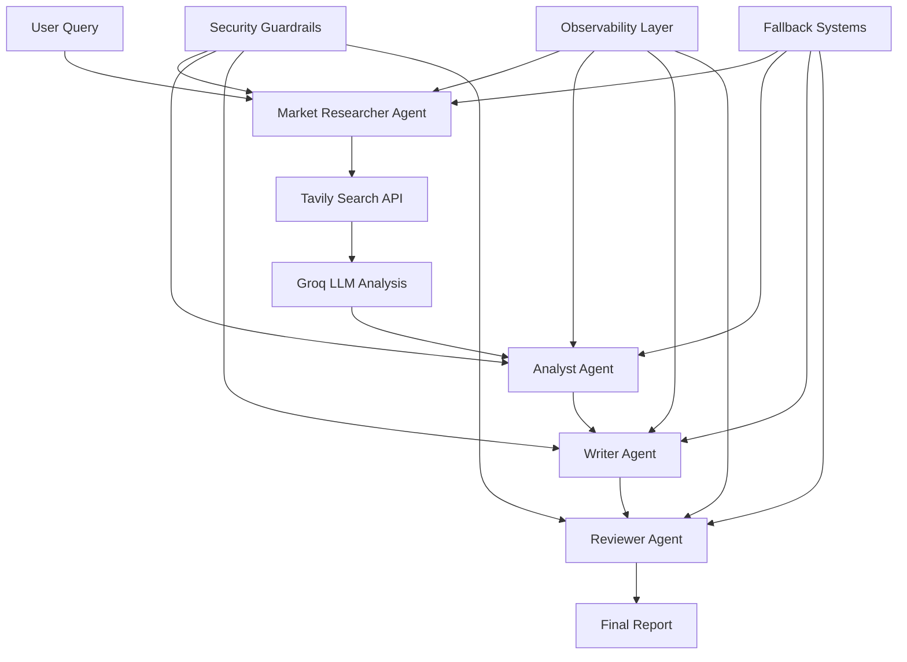

# 🔍 Insight Forge - AI-Powered Market Research Platform

[](https://python.org)
[](https://github.com/langchain-ai/langgraph)
[](https://console.groq.com/)
[](https://tavily.com/)
[](https://gradio.app/)
[](LICENSE)

> **A sophisticated multi-agent AI platform for automated market research, powered by LangGraph, Groq LLMs, and real-time web search with comprehensive safety measures and observability.**

## 🌟 Overview

Insight Forge is a cutting-edge market research platform that simulates a complete research pipeline from data collection to report generation. It uses a multi-agent architecture with AI-powered analysis, real-time web search, and comprehensive safety measures to deliver actionable market insights.

### 🎯 Key Features

- **🤖 Multi-Agent Architecture**: Specialized AI agents for research, analysis, writing, and review
- **🌐 Real-Time Web Search**: Powered by Tavily with unified client and MCP support
- **🧠 Advanced AI Analysis**: Groq LLM integration with intelligent fact extraction
- **🛡️ Enterprise Security**: Comprehensive guardrails, content moderation, and input validation
- **📊 Full Observability**: LangSmith tracing, metrics collection, and performance monitoring
- **🔄 Robust Fallbacks**: Graceful degradation and error recovery systems
- **🌐 Modern Web Interface**: Beautiful Gradio-based UI with real-time updates
- **📱 Rate Limit Resilience**: Works even when AI services are rate-limited

## 🏗️ Architecture



## 🚀 Quick Start

### Prerequisites

- Python 3.8+
- Tavily API key ([Get one here](https://tavily.com/))
- Groq API key ([Get one here](https://console.groq.com/))
- Optional: LangSmith API key for enhanced observability

### Installation

1. **Clone the repository**
   ```bash
   git clone https://github.com/your-username/insight-forge.git
   cd insight-forge
   ```

2. **Create virtual environment**
   ```bash
   python -m venv venv
   source venv/bin/activate  # On Windows: venv\Scripts\activate
   ```

3. **Install dependencies**
   ```bash
   pip install -r requirements.txt
   ```

4. **Set up environment variables**
   ```bash
   # Copy example environment file
   cp .env.example .env
   
   # Edit .env with your API keys
   export TAVILY_API_KEY=your_tavily_api_key_here
   export GROQ_API_KEY=your_groq_api_key_here
   export LANGSMITH_API_KEY=your_langsmith_api_key_here  # Optional
   ```

### Usage

#### 🌐 Web Interface (Recommended)
```bash
python gradio_app.py
```
Open your browser to `http://localhost:7860` for the interactive web interface.

#### 💻 Command Line Interface
```bash
python main.py
```

#### 📓 Jupyter Notebook
```bash
jupyter notebook notebooks/demo.ipynb
```

## 🔧 Configuration

### Environment Variables

| Variable | Required | Description |
|----------|----------|-------------|
| `TAVILY_API_KEY` | ✅ | Tavily search API key |
| `GROQ_API_KEY` | ✅ | Groq LLM API key |
| `LANGSMITH_API_KEY` | ❌ | LangSmith tracing (optional) |
| `LANGSMITH_PROJECT` | ❌ | LangSmith project name |

### API Keys Setup

1. **Tavily**: Get your API key from [tavily.com](https://tavily.com/)
2. **Groq**: Get your API key from [console.groq.com](https://console.groq.com/)
3. **LangSmith**: Optional, for enhanced observability from [langsmith.com](https://langsmith.com/)

## 📋 Workflow Process

1. **🔍 Query Input**: User provides research topic
2. **🌐 Data Collection**: Market Researcher uses Tavily to search and Groq to extract facts
3. **📊 Analysis**: Analyst validates facts and checks policy compliance
4. **✍️ Report Generation**: Writer creates structured research report
5. **🔍 Review**: Reviewer handles any violations or errors
6. **📤 Output**: Final JSON report with citations and metadata

## 🛡️ Security & Guardrails

### Content Safety
- **Prompt Hardening**: Prevents secret exfiltration and tool misuse
- **Content Moderation**: Automated safety checks and policy enforcement
- **Input Sanitization**: Comprehensive input validation and cleaning

### Data Validation
- **Schema Validation**: Pydantic-based output validation
- **Fact Verification**: Cross-reference facts with multiple sources
- **Source Attribution**: All facts include proper source URLs

### Error Handling
- **Retry Logic**: Exponential backoff for failed operations
- **Circuit Breakers**: Graceful degradation on repeated failures
- **Fallback Responses**: Stub data when external services fail

## 📊 Observability & Monitoring

### Metrics Tracked
- **Token Usage**: Total tokens, prompt tokens, completion tokens
- **Tool Performance**: Latency for Tavily, Groq, and Retriever
- **Reliability**: Success/failure rates, execution times
- **Error Tracking**: Tool errors, schema violations, policy violations

### Trace Export
All workflow executions are automatically traced and exported to the `artifacts/` directory as JSON files for analysis and debugging.

### LangSmith Integration
- Complete tracing and monitoring
- Performance analytics
- Error tracking and debugging
- Cost analysis and optimization

## 🏗️ Project Structure

```
insight-forge/
├── src/                           # Core source code
│   ├── agents.py                  # Multi-agent implementations
│   ├── graph.py                   # LangGraph workflow definition
│   ├── state.py                   # TypedDict state management
│   ├── fallbacks.py               # Retry and error handling
│   ├── observability.py           # LangSmith integration
│   ├── guardrails/                # Security and validation
│   │   ├── schemas.py            # Pydantic validation schemas
│   │   ├── moderation.py         # Content safety checks
│   │   └── prompt_hardening.py   # Safety and prompt hardening
│   └── tools/                     # External service integrations
│       ├── tavily_unified_client.py  # Unified Tavily client
│       ├── groq_llm.py           # Groq LLM client
│       └── retriever.py          # Data retrieval with fallbacks
├── notebooks/                     # Jupyter notebooks
│   └── demo.ipynb                # Interactive demo
├── tests/                        # Test suite
│   └── test_mcp_integration.py   # Integration tests
├── docs/                         # Documentation
│   ├── MCP_INTEGRATION.md        # MCP integration guide
│   └── TAVILY_CONSOLIDATION.md   # Client consolidation guide
├── artifacts/                    # Generated traces and outputs
├── gradio_app.py                 # Web interface
├── main.py                       # CLI entry point
├── requirements.txt              # Python dependencies
└── README.md                     # This file
```

## 🔄 Advanced Features

### Multi-Agent Workflow
- **Market Researcher**: Intelligent data extraction using Groq LLMs and Tavily search
- **Analyst**: Schema validation and policy compliance checking
- **Writer**: Automated report generation with structured output
- **Reviewer**: Human-in-the-loop validation for complex cases

### Unified Tavily Client
- **MCP Support**: Model Context Protocol integration for advanced features
- **Automatic Fallbacks**: Graceful degradation when services are unavailable
- **Rate Limit Resilience**: Works even when APIs are rate-limited
- **Content Extraction**: Extract content from specific URLs

### Error Recovery
- **Multi-Level Fallbacks**: From MCP to direct API to basic extraction
- **Graceful Degradation**: Maintains functionality even with service failures
- **Comprehensive Logging**: Detailed error tracking and debugging information

## 🧪 Testing

### Run Tests
```bash
# Run integration tests
python tests/test_mcp_integration.py

# Test specific functionality
python -c "from src.graph import run_market_research; print(run_market_research('test query'))"
```

### Test Coverage
- Unit tests for individual components
- Integration tests for full workflows
- Error handling and fallback scenarios
- Performance and reliability testing

## 🚀 Deployment

### Local Development
```bash
# Start development server
python gradio_app.py --dev

# Run with debug logging
LOG_LEVEL=DEBUG python main.py
```

### Production Deployment
```bash
# Build production image
docker build -t insight-forge .

# Run production container
docker run -p 7860:7860 -e TAVILY_API_KEY=your_key -e GROQ_API_KEY=your_key insight-forge
```

## 📈 Performance

### Benchmarks
- **Search Latency**: < 2 seconds for most queries
- **Report Generation**: < 10 seconds for comprehensive reports
- **Concurrent Users**: Supports multiple simultaneous users
- **Rate Limiting**: Intelligent handling of API rate limits

### Optimization
- **Caching**: Intelligent caching of search results
- **Parallel Processing**: Concurrent agent execution
- **Resource Management**: Efficient memory and CPU usage
- **Error Recovery**: Fast fallback mechanisms

## 🤝 Contributing

We welcome contributions! Please see our [Contributing Guidelines](CONTRIBUTING.md) for details.

### Development Setup
```bash
# Fork and clone the repository
git clone https://github.com/your-username/insight-forge.git
cd insight-forge

# Create development environment
python -m venv venv
source venv/bin/activate
pip install -r requirements.txt
pip install -r requirements-dev.txt

# Run tests
pytest tests/
```

## 📄 License

This project is licensed under the MIT License - see the [LICENSE](LICENSE) file for details.

## 🙏 Acknowledgments

- [LangGraph](https://github.com/langchain-ai/langgraph) for the multi-agent framework
- [Groq](https://console.groq.com/) for high-performance LLM inference
- [Tavily](https://tavily.com/) for real-time web search
- [Gradio](https://gradio.app/) for the beautiful web interface
- [LangSmith](https://langsmith.com/) for observability and monitoring

## 📞 Support

- **Documentation**: [docs/](docs/)
- **Issues**: [GitHub Issues](https://github.com/your-username/insight-forge/issues)
- **Discussions**: [GitHub Discussions](https://github.com/your-username/insight-forge/discussions)
- **Email**: support@insight-forge.com

---

**Built with ❤️ for the AI research community**

*Insight Forge - Transforming market research with the power of AI*